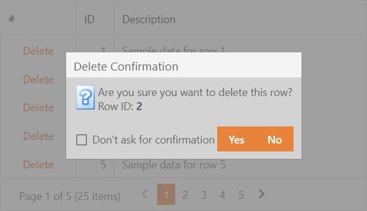

<!-- default badges list -->

<!-- default badges end -->
# Grid View for ASP.NET Web Forms - How to implement a delete confirmation dialog with a "don't ask me again" option
<!-- run online -->
**[[Run Online]](https://codecentral.devexpress.com/128540794/)**
<!-- run online end -->

This example demonstrates how to implement a delete confirmation dialog with an option to prevent its displays for subsequent grid row deletions.

## Implementation Details

The confirm dialog is based on the [ASPxPopupControl](https://docs.devexpress.com/AspNet/DevExpress.Web.ASPxPopupControl). The popup contains the dialog content wrapped in a WebUserControl.

> **Note:** In this example, the "Don't ask confirmation" check box's value is stored in a client JavaScript variable (`dontAskConfirmation`). We recommend that in a real-life application you save this value to a user-specific storage such as cookies or user profile settings.

The example application uses the following techniques:

- The `ID` field value of the processed row is stored in the client `rowVisibleIndex` variable.

- The ASPxPopupControl is made transparent so that it displays its child [ASPxRoundPanel](https://docs.devexpress.com/AspNet/DevExpress.Web.ASPxRoundPanel) as the dialog's immediate container.

- The ASPxPopupControl is used in modal mode and configured to always be displayed at the Grid View's center.

- The "Yes" button is made the dialog's default button (its ID is assigned to the ASPxRoundPanel's [DefaultButton](https://docs.devexpress.com/AspNet/DevExpress.Web.ASPxPanelBase.DefaultButton) property) so that you can press  `Enter` to submit the dialog. The "Yes" button programmatically receives the input focus after the dialog is shown.

## Files to Review

- [TestData.cs](./CS/Solution/App_Code/TestData.cs) (VB: [TestData.vb](./VB/Solution/App_Code/TestData.vb))
- [Default.aspx](./CS/Solution/Default.aspx) (VB: [Default.aspx](./VB/Solution/Default.aspx))
- [Default.aspx.cs](./CS/Solution/Default.aspx.cs) (VB: [Default.aspx.vb](./VB/Solution/Default.aspx.vb))
- [WebUserControl.ascx](./CS/Solution/WebUserControl.ascx) (VB: [WebUserControl.ascx](./VB/Solution/WebUserControl.ascx))
- [WebUserControl.ascx.cs](./CS/Solution/WebUserControl.ascx.cs) (VB: [WebUserControl.ascx.vb](./VB/Solution/WebUserControl.ascx.vb))

## Documentation

- [Edit Data](https://docs.devexpress.com/AspNet/3712/components/grid-view/concepts/edit-data)
- [Popup Control](https://docs.devexpress.com/AspNet/3582/components/docking-and-popups/popup-control)
- [RoundPanel](https://docs.devexpress.com/AspNet/8292/components/multi-use-site-controls/roundpanel)

## More Examples

- [How to include a deleted row KeyField value into the delete confirmation dialog](https://supportcenter.devexpress.com/ticket/details/e131/how-to-include-a-deleted-row-keyfield-value-into-the-delete-confirmation-dialog)
- [How to insert (or update) ASPxTreeList's row by clicking on an external button and delete rows with custom confirmation popup window](https://supportcenter.devexpress.com/internal/ticket/details/E2938)
- [How to show a confirmation dialog using ASPxPopupControl](https://supportcenter.devexpress.com/internal/ticket/details/T103862)

